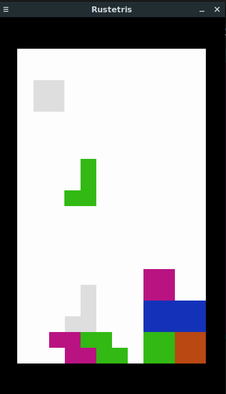

# Rustetris

Simple tetris with Rust for learning. Using pixels and winit.

# Instructions to run

### Windows

Download and run [the exe file of release 0.1](https://github.com/ShootingStar91/rustetris/releases/download/0.1/rustetris.exe)

### Linux

Download the [linux executable file](https://github.com/ShootingStar91/rustetris/releases/download/0.1/rustetris)

To run, in the download folder do `sudo chmod 777 ./rustetris` and then `./rustetris`

Alternatively, clone and run the project's source directly with Rust's package manager cargo.

```
git clone https://github.com/ShootingStar91/rustetris
cd rustetris
cargo run
```



